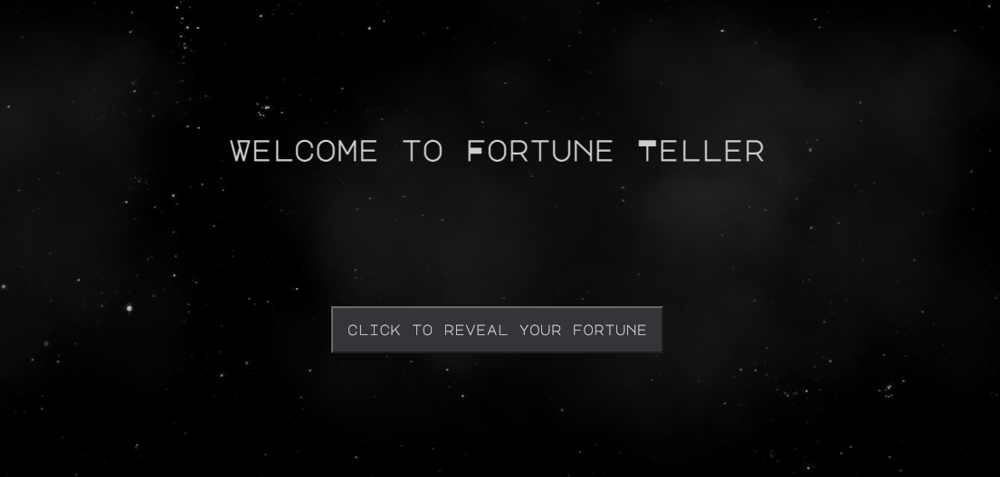

# Fortune Teller

## Table of contents
* [General information](#general-information)
* [Technologies](#technologies)
* [Setup](#setup)
* [Inspiration](#inspiration)

## General information
This is a JavaScript project to generate a fortune with multiple randomized sub-strings, so each fortune is (pretty) unique. In total, there are 6,804 unique fortunes.  

The randomized sub-substrings are assocaited with topics to avoid nonsensical fortunes. Topics include, for example, good relationships, bad relationships, change, etc.

Fortunes created have a first sentence and a second sentence. Both sentences include a phrase based in a randomly selected topic, a first phrase and second phrase, respectively. First phrases are each associated with 1 topic. Second phrases can be associated with multiple topics. 

The fortunes are displayed on a webpage, using CSS and HTML. 

This project helped me learn skills through building, including, import and export in JavaScript and require() for Node.js, using git in the command line for version control, array manipulations such as .push() and .reduce(), switch statements, randomization, string literals, JavaScript objects and dot notation for accessing properties, creating helper functions and employing a separation of concerns, manipulating the document object model (DOM) using JavaScript, and using a KanBan board to keep track of tasks and progress.

## Technologies
Project is created with:
* VS Code version 1.58.1
* Git version 2.30.1
* Node version 14.17.1 

## Setup
This project can be viewed at [http://carokrny.github.io/fortune_teller](http://carokrny.github.io/fortune_teller). Click through to have your fortune told! 

## Inspiration 
This project is based on Codecademy's Mixed Messages Project. Codecademy provided the broad prompt of a random message genorator. Starter code was not provided in this project. HTML & CSS was added later to turn the console-based project into a website.

Thank you to [Carla Codes](https://github.com/Carla-Codes) for the *excellent* [tutorial](https://www.youtube.com/watch?v=0t6Dmp70kTw) on making a twinkling night sky backgroud. 